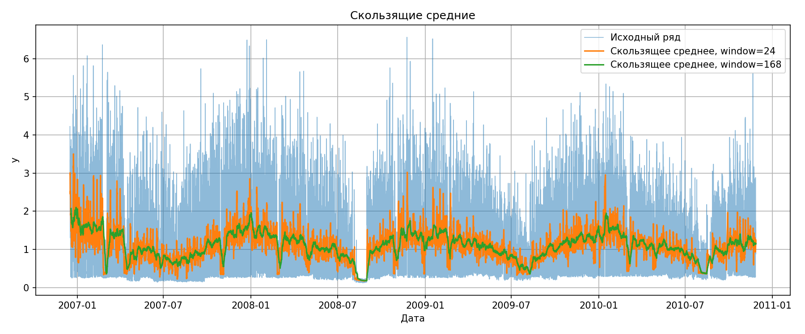

# Анализ временного ряда электропотребления

Проект по дисциплине **«Анализ временных рядов»**.

В работе исследуется временной ряд бытового электропотребления на основе датасета **Individual Household Electric Power Consumption**. Основная цель проекта — подготовить временной ряд, провести EDA, исследовать аномалии, сравнить baseline, статистические, ML- и DL-модели прогнозирования, а затем собрать воспроизводимый пайплайн прогноза на 24 часа.

---

## 1. Краткий итог работы

В проекте выполнены 4 задания итоговой работы:

| Задание | Содержание | Результат |
|---|---|---|
| №1 | Подготовка данных, постановка задачи, EDA | Минутный ряд преобразован в регулярный часовой ряд без пропусков; выявлены суточная и недельная сезонность |
| №2 | Статистические методы прогнозирования | Сравнены baseline, ручные и автоматические статистические модели; лучшая модель — `seasonal_window_average` |
| №3 | Аномалии, ML и DL | Сравнены 3 метода поиска аномалий, 3 ML-модели и 3 DL-модели |
| №4 | Итоговый пайплайн | Собран воспроизводимый пайплайн с проверками данных, прогнозом, статистическими тестами и оценкой производительности |

**Главный результат:** лучшей моделью по среднему качеству backtesting стала статистическая модель `seasonal_window_average` с `sMAPE = 32.4678`. Она оказалась сильнее ML- и DL-моделей, потому что в ряде электропотребления ярко выражены суточная и недельная сезонность.

---

## 2. Данные и постановка задачи

### Источник данных

Используется датасет **Individual Household Electric Power Consumption**.

Официальный источник данных:  
<https://archive.ics.uci.edu/dataset/235/individual+household+electric+power+consumption>

Дополнительная ссылка на исходный файл в облачном хранилище:  
<https://drive.google.com/file/d/1huxQbuI0wZFlrCssrp3KM6mY3CMDV9ZL/view?usp=sharing>

Исходный файл `household_power_consumption.txt` имеет большой размер, поэтому он не добавляется в Git-репозиторий. Для воспроизведения проекта его нужно скачать и положить вручную:

```text
data/raw/household_power_consumption.txt
```

Подготовленный временной ряд сохраняется в файл:

```text
data/processed/prepared_time_series.csv
```

### Постановка задачи

| Параметр | Значение |
|---|---|
| Тип задачи | Краткосрочное offline-прогнозирование временного ряда |
| Исходная частота | 1 минута |
| Рабочая частота после агрегации | 1 час |
| Целевая переменная | `y` — среднее часовое значение `Global_active_power` |
| Идентификатор ряда | `household_1` |
| Горизонт прогноза | 24 часа |
| Метрики качества | MAE, RMSE, MAPE, sMAPE, MASE |

Минутные данные агрегируются до часовой частоты по среднему значению `Global_active_power`. Такой подход уменьшает шум, ускоряет обучение моделей и сохраняет прикладной смысл переменной как среднего уровня активной мощности за час.

---

## 3. Структура проекта

```text
data/
  raw/                         # исходный файл данных, не хранится в GitHub
  processed/                   # подготовленный временной ряд
models/                        # сохраненные модели
notebooks/
  main_pipeline.ipynb          # Jupyter Notebook с кодом и комментариями
outputs/
  forecasts/                   # прогнозы моделей
reports/
  figures/                     # визуализации
  tables/                      # таблицы метрик, тестов и диагностики
  *.md                         # подробные markdown-отчеты
scripts/                       # скрипты запуска этапов
src/                           # код подготовки, моделей и пайплайна
tests/                         # тесты проекта
README.md
TASK_CHECKLIST.md
requirements.txt
```

---

## 4. Задание №1. Подготовка данных и EDA

### Что было сделано

1. Загружен исходный файл `household_power_consumption.txt`.
2. Колонки `Date` и `Time` объединены в единую временную метку `ds`.
3. Символы пропусков `?` преобразованы в `NaN`.
4. Числовые признаки приведены к числовому типу.
5. Минутный ряд агрегирован до часовой частоты.
6. Ряд приведен к регулярной часовой сетке.
7. Пропуски после агрегации заполнены интерполяцией по времени.
8. Подготовленный ряд сохранен в `data/processed/prepared_time_series.csv`.

### Численные результаты подготовки

| Показатель | Значение |
|---|---:|
| Количество часовых наблюдений | 34 589 |
| Начало ряда | 2006-12-16 17:00:00 |
| Конец ряда | 2010-11-26 21:00:00 |
| Пропуски в целевой переменной после подготовки | 0 |
| Рабочая частота | 1 час |
| Среднее значение ряда | 1.0925 |
| Стандартное отклонение | 0.8957 |
| Минимум | 0.1240 |
| Максимум | 6.5605 |

### Проверка стационарности

| Тест | Статистика | p-value | Вывод |
|---|---:|---:|---|
| ADF | -10.5035 | 1.07e-18 | есть аргумент в пользу стационарности |
| KPSS | 6.9562 | 0.0100 | гипотеза стационарности отвергается |

ADF и KPSS дают разные выводы. Поэтому ряд нельзя считать полностью стационарным без учета сезонности и структуры потребления. Для дальнейших моделей важно учитывать суточный период `24` и недельный период `168`.

### Визуализации EDA

Общий график подготовленного временного ряда:


Последние 60 дней ряда:


Скользящие средние:



Средний профиль по часу суток:


Средний профиль по дню недели:


ACF и PACF:


### Вывод по заданию №1

Временной ряд успешно подготовлен для моделирования: он имеет регулярную часовую частоту, не содержит пропусков в целевой переменной и сохраняет выраженную сезонную структуру. EDA показал, что для электропотребления важны повторяющиеся внутрисуточные и недельные паттерны, поэтому в моделях используются сезонные периоды `24` и `168`.

Подробный отчет: [`reports/eda_results.md`](reports/eda_results.md).

---

## 5. Задание №2. Статистические методы прогнозирования

### Проверенные методы

В статистическом блоке сравнивались baseline-модели, простые статистические модели, ручные модели и автоматические модели из `statsforecast`.

| Группа | Модели |
|---|---|
| Baseline | `naive`, `seasonal_naive_24`, `seasonal_naive_168` |
| Простые статистические | `window_average_168`, `seasonal_window_average`, `drift` |
| Ручные статистические | `manual_ets_additive`, `manual_theta_24`, `manual_arima` |
| Автоматические статистические | `auto_arima`, `auto_ets`, `auto_theta` |

Проверка качества выполнялась через backtesting по временным окнам: модель обучалась только на прошлом и прогнозировала следующие 24 часа. Такой подход корректен для временных рядов, потому что не допускает перемешивания прошлого и будущего.

### Результаты статистических моделей

| Место | Модель | MAE | RMSE | MAPE | sMAPE | MASE |
|---:|---|---:|---:|---:|---:|---:|
| 1 | seasonal_window_average | 0.3306 | 0.4246 | 41.3157 | 32.4678 | 0.5172 |
| 2 | seasonal_naive_168 | 0.3494 | 0.4966 | 42.4453 | 35.4190 | 0.5467 |
| 3 | auto_ets | 0.3969 | 0.4917 | 55.3339 | 40.8020 | 0.6210 |
| 4 | auto_theta | 0.4029 | 0.4949 | 52.2807 | 41.1704 | 0.6303 |
| 5 | manual_theta_24 | 0.4031 | 0.4949 | 52.2844 | 41.1904 | 0.6307 |
| 6 | seasonal_naive_24 | 0.4411 | 0.5822 | 57.6934 | 44.4558 | 0.6902 |
| 7 | manual_ets_additive | 0.4192 | 0.5186 | 47.9249 | 44.6641 | 0.6559 |
| 8 | auto_arima | 0.4234 | 0.5092 | 73.2767 | 45.2895 | 0.6624 |
| 9 | window_average_168 | 0.6003 | 0.7019 | 102.0992 | 58.7645 | 0.9392 |
| 10 | manual_arima | 0.6169 | 0.7204 | 109.0453 | 59.5385 | 0.9652 |
| 11 | naive | 0.6524 | 0.7793 | 133.7039 | 59.8480 | 1.0207 |
| 12 | drift | 0.6531 | 0.7804 | 134.0492 | 59.8669 | 1.0219 |

### Визуализации статистических моделей

Сравнение метрик статистических моделей:


Backtesting статистических моделей:


Финальный прогноз статистической модели:


Остатки лучшей статистической модели:


ACF остатков:


### Анализ остатков

Для лучшей статистической модели `seasonal_window_average` был выполнен анализ остатков.

| Показатель | Значение |
|---|---:|
| Среднее остатков | -0.0260 |
| Стандартное отклонение остатков | 0.4258 |
| MAE остатков | 0.3306 |
| Автокорреляция остатков на лаге 1 | 0.4567 |
| p-value Ljung-Box, лаг 24 | 4.06e-08 |

Малое p-value теста Ljung-Box показывает, что в остатках сохраняется автокорреляционная структура. Это не делает модель некорректной, но показывает, что ряд содержит более сложные зависимости, которые могут быть дополнительно исследованы ML- и DL-моделями.

### Вывод по заданию №2

Лучшей статистической моделью стала `seasonal_window_average` с `sMAPE = 32.4678`. Модель хорошо подходит для часового электропотребления, потому что использует повторяемость одинаковых часов недели и сглаживает случайные всплески. Она существенно превосходит простую naive-модель и недельный seasonal naive baseline.

Подробный отчет: [`reports/statistical_models.md`](reports/statistical_models.md).

---

## 6. Задание №3. Аномалии, ML и DL

### 6.1. Анализ аномалий

Для выявления аномалий были проверены 3 метода.

| Метод | Параметры | Логика |
|---|---|---|
| Rolling z-score | окно 168 часов, порог 3.5 | сравнение с локальным уровнем ряда |
| Seasonal IQR | профиль по часу недели, IQR = 3.0 | поиск отклонений от сезонного профиля |
| Isolation Forest | contamination = 0.01 | многомерный поиск нетипичных наблюдений |

### Результаты поиска аномалий

| Метод | Количество аномалий | Доля, % |
|---|---:|---:|
| rolling_z_score | 309 | 0.893 |
| seasonal_iqr | 363 | 1.049 |
| isolation_forest | 345 | 0.997 |

Основным методом выбран **Seasonal IQR**, потому что он учитывает недельный профиль временного ряда и не считает обычные утренние или вечерние пики аномалиями.

Аномалии на полном ряде:


Аномалии за последние 90 дней:


Сравнение методов поиска аномалий:


### Вывод по анализу аномалий

Метод Seasonal IQR выявил 363 аномальных наблюдения, что составляет 1.049% подготовленного часового ряда. Аномалии не удаляются автоматически, так как они могут отражать реальные пики потребления. Они используются как диагностическая информация и могут быть добавлены в модели как отдельный признак.

Подробный отчет: [`reports/anomaly_detection.md`](reports/anomaly_detection.md).

### 6.2. ML-модели

Для ML-моделей временной ряд был преобразован в табличную задачу регрессии. Использовались лаги, скользящие статистики и календарные признаки.

Основные признаки:

- лаги: `1`, `2`, `3`, `6`, `12`, `24`, `48`, `72`, `168`;
- скользящие статистики по окнам `24` и `168`;
- календарные признаки: час суток, день недели, месяц, признак выходного дня;
- циклическое кодирование часа и дня недели через `sin` и `cos`.

### Результаты ML-моделей

| Место | Модель | MAE | RMSE | MAPE | sMAPE | MASE |
|---:|---|---:|---:|---:|---:|---:|
| 1 | random_forest | 0.3421 | 0.4300 | 48.3824 | 35.8655 | 0.5352 |
| 2 | hist_gradient_boosting | 0.3769 | 0.4769 | 51.3950 | 37.2044 | 0.5897 |
| 3 | ridge_regression | 0.4056 | 0.5286 | 53.8389 | 39.0194 | 0.6345 |

Сравнение метрик ML-моделей:


Backtesting ML-моделей:


Прогноз ML-моделей:


### Вывод по ML-моделям

Лучшей ML-моделью стала `random_forest` с `sMAPE = 35.8655`. Она использует лаговые, календарные и скользящие признаки и хорошо работает с нелинейными зависимостями. Однако в данном эксперименте ML-модель не превзошла лучшую статистическую модель.

Подробный отчет: [`reports/machine_learning_models.md`](reports/machine_learning_models.md).

### 6.3. DL-модели

Проверены 3 DL-модели.

| Модель | Логика |
|---|---|
| neural_mlp | нелинейный прогноз по историческому окну |
| nbeats | нейросетевая модель с остаточными блоками |
| nhits | иерархическая нейросетевая модель для временных рядов |

Параметры эксперимента:

| Параметр | Значение |
|---|---|
| Горизонт прогноза | 24 часа |
| Историческое окно | 168 часов |
| Максимальное число шагов обучения | 60 |
| Обучающая часть для локального запуска | последний год наблюдений |

### Результаты DL-моделей

| Место | Модель | MAE | RMSE | MAPE | sMAPE | MASE |
|---:|---|---:|---:|---:|---:|---:|
| 1 | nbeats | 0.3503 | 0.4421 | 42.6360 | 35.7025 | 0.6141 |
| 2 | neural_mlp | 0.3518 | 0.4536 | 39.1979 | 37.9348 | 0.6166 |
| 3 | nhits | 0.3810 | 0.4736 | 55.2723 | 39.6782 | 0.6678 |

Сравнение метрик DL-моделей:


Backtesting DL-моделей:


Прогноз DL-моделей:


### Вывод по DL-моделям

Лучшей DL-моделью стала `nbeats` с `sMAPE = 35.7025`. Она показала качество, близкое к лучшей ML-модели, но не превзошла лучшую статистическую модель. Это важный вывод: для данного временного ряда регулярная сезонная структура оказалась настолько сильной, что простая сезонная статистическая модель дала лучший результат.

Подробный отчет: [`reports/neural_models.md`](reports/neural_models.md).

---

## 7. Общая таблица выбора методов анализа временного ряда

В итоговом сравнении участвуют baseline, статистические модели, ML-модели и DL-модели.

| Место | Группа | Модель | MAE | RMSE | MAPE | sMAPE | MASE |
|---:|---|---|---:|---:|---:|---:|---:|
| 1 | statistical | seasonal_window_average | 0.3306 | 0.4246 | 41.3157 | 32.4678 | 0.5172 |
| 2 | statistical | seasonal_naive_168 | 0.3494 | 0.4966 | 42.4453 | 35.4190 | 0.5467 |
| 3 | DL | nbeats | 0.3503 | 0.4421 | 42.6360 | 35.7025 | 0.6141 |
| 4 | ML | random_forest | 0.3421 | 0.4300 | 48.3824 | 35.8655 | 0.5352 |
| 5 | ML | hist_gradient_boosting | 0.3769 | 0.4769 | 51.3950 | 37.2044 | 0.5897 |
| 6 | DL | neural_mlp | 0.3518 | 0.4536 | 39.1979 | 37.9348 | 0.6166 |
| 7 | ML | ridge_regression | 0.4056 | 0.5286 | 53.8389 | 39.0194 | 0.6345 |
| 8 | DL | nhits | 0.3810 | 0.4736 | 55.2723 | 39.6782 | 0.6678 |
| 9 | statistical | auto_ets | 0.3969 | 0.4917 | 55.3339 | 40.8020 | 0.6210 |
| 10 | statistical | auto_theta | 0.4029 | 0.4949 | 52.2807 | 41.1704 | 0.6303 |
| 11 | statistical | manual_theta_24 | 0.4031 | 0.4949 | 52.2844 | 41.1904 | 0.6307 |
| 12 | statistical | seasonal_naive_24 | 0.4411 | 0.5822 | 57.6934 | 44.4558 | 0.6902 |
| 13 | statistical | manual_ets_additive | 0.4192 | 0.5186 | 47.9249 | 44.6641 | 0.6559 |
| 14 | statistical | auto_arima | 0.4234 | 0.5092 | 73.2767 | 45.2895 | 0.6624 |
| 15 | statistical | window_average_168 | 0.6003 | 0.7019 | 102.0992 | 58.7645 | 0.9392 |
| 16 | statistical | manual_arima | 0.6169 | 0.7204 | 109.0453 | 59.5385 | 0.9652 |
| 17 | baseline | naive | 0.6524 | 0.7793 | 133.7039 | 59.8480 | 1.0207 |
| 18 | statistical | drift | 0.6531 | 0.7804 | 134.0492 | 59.8669 | 1.0219 |

Визуализация общего сравнения моделей:


### Комментарий к выбору модели

Итоговой моделью выбрана `seasonal_window_average`. Она победила по `sMAPE` на backtesting-окнах и имеет простую интерпретацию: прогноз строится как усреднение значений для аналогичных часов недели. Такой метод хорошо подходит для бытового электропотребления, где повторяются суточные и недельные паттерны.

Важно, что более сложные ML- и DL-модели не дали улучшения относительно лучшей статистической модели. Это не является ошибкой: для рядов с сильной регулярной сезонностью простая статистическая модель может быть устойчивее и надежнее, особенно при ограниченной настройке нейросетевых моделей.

---

## 8. Задание №4. Итоговый пайплайн

### Логика пайплайна

Итоговый пайплайн выполняет следующие этапы:

1. Загружает подготовленный временной ряд.
2. Проверяет обязательные колонки `unique_id`, `ds`, `y`.
3. Проверяет дубликаты, пропуски, регулярность частоты и неотрицательность ряда.
4. Загружает таблицы качества моделей.
5. Выбирает модель по основной метрике `sMAPE`.
6. Строит прогноз на 24 часа.
7. Проводит backtesting.
8. Выполняет статистическое тестирование остатков.
9. Измеряет время выполнения и пиковую память.
10. Сохраняет таблицы, прогнозы и графики.

### Метрики итогового пайплайна

| Модель | MAE | RMSE | MAPE | sMAPE | MASE |
|---|---:|---:|---:|---:|---:|
| seasonal_naive_168 | 0.4102 | 0.5725 | 42.1455 | 37.6462 | 0.6421 |
| seasonal_window_average | 0.4100 | 0.5096 | 55.9527 | 41.1866 | 0.6417 |

В среднем по backtesting-окнам лучшей моделью была `seasonal_window_average`. На отдельном финальном операционном окне она имеет меньшие MAE, RMSE и MASE, но уступает `seasonal_naive_168` по sMAPE. Это важный практический вывод: модель необходимо оценивать не только по средней метрике на нескольких окнах, но и по устойчивости на новых временных интервалах.

### Проверка входных данных

| Проверка | Статус | Детали |
|---|---|---|
| required_columns | pass | обязательные колонки `unique_id`, `ds`, `y` есть |
| no_duplicate_timestamps | pass | дубликатов временных меток нет |
| no_missing_target | pass | пропусков в `y` нет |
| regular_hourly_frequency | pass | нерегулярных шагов нет |
| enough_history | pass | 34 589 наблюдений, истории достаточно |
| non_negative_target | pass | отрицательных значений нет |

### Статистическое тестирование пайплайна

| Тест | Статистика | p-value | Статус | Интерпретация |
|---|---:|---:|---|---|
| bias_ttest | -0.0953 | 0.9242 | pass | среднее смещение остатков статистически незначимо |
| ljung_box_lag_24 | 67.3272 | 5.51e-06 | warn | в остатках осталась автокорреляционная структура |
| paired_ttest_vs_seasonal_naive_168 | -0.0069 | 0.9945 | pass | отличие абсолютных ошибок от seasonal naive статистически незначимо |

### Производительность пайплайна

| Этап | Время, сек. |
|---|---:|
| Загрузка данных | 0.0756 |
| Проверка данных | 0.0043 |
| Выбор модели | 0.0243 |
| Backtesting | 0.4800 |
| Прогноз | 0.0768 |
| Статистические тесты | 0.0563 |
| Построение графиков | 2.1362 |
| Полное время выполнения | 2.8538 |
| Пиковая память, MB | 6.2955 |

### Визуализации итогового пайплайна

Backtesting итогового пайплайна:


Финальный прогноз на 24 часа:


Остатки итогового пайплайна:


### Вывод по заданию №4

Итоговый пайплайн является воспроизводимой частью проекта. После запуска `python scripts/run_pipeline.py` формируются таблицы качества, прогнозы, графики, проверки входных данных, статистические тесты и отчет по пайплайну. Пайплайн закрывает финальный этап исследования, но результаты финального окна показывают, что выбранную модель необходимо дополнительно проверять на новых временных окнах.

Подробный отчет: [`reports/pipeline.md`](reports/pipeline.md).

---

## 9. Общие выводы по работе

1. Исходный минутный ряд электропотребления был успешно преобразован в регулярный часовой ряд.
2. После подготовки в целевой переменной нет пропусков, а временная сетка является регулярной.
3. EDA показал выраженную суточную и недельную сезонность, поэтому в моделях использованы периоды `24` и `168`.
4. Проверка стационарности дала неоднозначный результат: ADF указывает на стационарность, KPSS отвергает стационарность. Это объяснимо для ряда с сезонностью и изменяющимся уровнем.
5. Для поиска аномалий выбран Seasonal IQR, так как он учитывает недельный профиль и лучше подходит для электропотребления, чем простые глобальные методы.
6. Лучшей статистической моделью стала `seasonal_window_average`, `sMAPE = 32.4678`.
7. Лучшей ML-моделью стала `random_forest`, `sMAPE = 35.8655`.
8. Лучшей DL-моделью стала `nbeats`, `sMAPE = 35.7025`.
9. Более сложные ML- и DL-модели не превзошли лучшую статистическую модель. Для данного ряда регулярная сезонность оказалась сильнее, чем выигрыш от усложнения моделей.
10. Анализ остатков показал наличие автокорреляции, поэтому дальнейшее улучшение возможно за счет внешних факторов, более тонкой настройки моделей и дополнительных признаков.
11. Итоговый пайплайн проходит проверки данных, строит прогноз, сохраняет артефакты и выполняется примерно за 2.85 секунды на локальном запуске.

---

## 10. Как запустить проект

Рекомендуется Python 3.11.

```bash
py -3.11 -m venv .venv
source .venv/Scripts/activate
python -m pip install --upgrade pip setuptools wheel
python -m pip install -r requirements.txt
```

Подготовка данных и EDA:

```bash
python scripts/prepare_eda.py
```

Статистические модели:

```bash
python scripts/statistical_forecast.py
```

Анализ аномалий:

```bash
python scripts/analyze_anomalies.py
```

ML-модели:

```bash
python scripts/machine_learning_forecast.py
```

DL-модели:

```bash
python scripts/neural_forecast.py
```

Итоговый пайплайн:

```bash
python scripts/run_pipeline.py
```

Полный запуск всех этапов:

```bash
python scripts/run_all.py
```

Jupyter Notebook:

```bash
jupyter notebook notebooks/main_pipeline.ipynb
```

---

## 11. Основные артефакты

| Артефакт | Путь |
|---|---|
| Подготовленный временной ряд | `data/processed/prepared_time_series.csv` |
| Notebook | `notebooks/main_pipeline.ipynb` |
| Общая таблица моделей | `reports/tables/model_comparison.csv` |
| Итоговый прогноз | `outputs/forecasts/pipeline_forecast.csv` |
| Отчет по EDA | `reports/eda_results.md` |
| Отчет по аномалиям | `reports/anomaly_detection.md` |
| Отчет по статистическим моделям | `reports/statistical_models.md` |
| Отчет по ML-моделям | `reports/machine_learning_models.md` |
| Отчет по DL-моделям | `reports/neural_models.md` |
| Отчет по пайплайну | `reports/pipeline.md` |
| Общий отчет | `reports/REPORT.md` |
| Чек-лист задания | `TASK_CHECKLIST.md` |
