# Отчет об исследовании временного ряда электропотребления

## 1. Цель работы

Цель работы — выполнить полный цикл анализа временного ряда: подготовить данные, провести EDA, исследовать аномалии, сравнить статистические, ML- и DL-модели прогнозирования, а затем собрать воспроизводимый пайплайн решения задачи прогнозирования.

В качестве объекта исследования выбран временной ряд бытового электропотребления из датасета **Individual Household Electric Power Consumption**. Целевая переменная — `Global_active_power`, агрегированная до среднего часового значения `y`.

---

## 2. Постановка задачи

| Параметр | Значение |
|---|---|
| Тип задачи | Прогнозирование временного ряда |
| Горизонт прогнозирования | 24 часа |
| Исходная частота данных | 1 минута |
| Рабочая частота | 1 час |
| Целевая переменная | `y`, среднее часовое значение `Global_active_power` |
| Основные метрики | MAE, RMSE, MAPE, sMAPE, MASE |
| Режим работы | Offline-прогнозирование |

Практический смысл задачи — построить модель, которая прогнозирует электропотребление на следующие 24 часа на основе исторических данных.

---

## 3. Задание №1. Подготовка данных и EDA

### 3.1. Подготовка данных

Исходные данные содержат минутные измерения электропотребления. Для приведения данных к задаче прогнозирования были выполнены следующие шаги:

1. Загружен исходный файл `household_power_consumption.txt`.
2. Поля `Date` и `Time` объединены в единую временную метку `ds`.
3. Значения `?` преобразованы в пропуски `NaN`.
4. Числовые признаки приведены к числовому типу.
5. Ряд агрегирован до часовой частоты.
6. Временная сетка приведена к регулярному шагу 1 час.
7. Пропуски после агрегации заполнены интерполяцией по времени.
8. Подготовленный ряд сохранен в `data/processed/prepared_time_series.csv`.

### 3.2. Результаты подготовки

| Показатель | Значение |
|---|---:|
| Количество часовых наблюдений | 34 589 |
| Начало ряда | 2006-12-16 17:00:00 |
| Конец ряда | 2010-11-26 21:00:00 |
| Пропуски после подготовки | 0 |
| Среднее значение | 1.0925 |
| Стандартное отклонение | 0.8957 |
| Минимум | 0.1240 |
| Максимум | 6.5605 |

### 3.3. EDA и стационарность

Для анализа временного ряда были построены графики полного ряда, последних 60 дней, скользящих средних, средних профилей по часу суток и дню недели, а также ACF/PACF.

Общий график ряда:

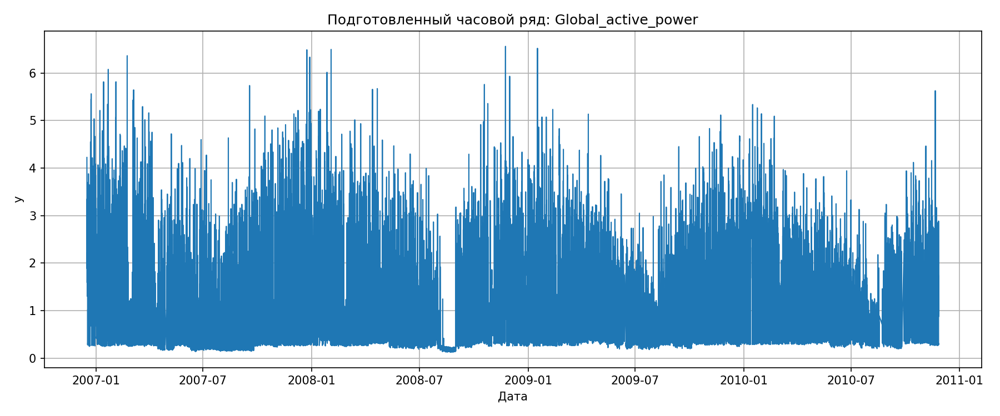

Последние 60 дней:

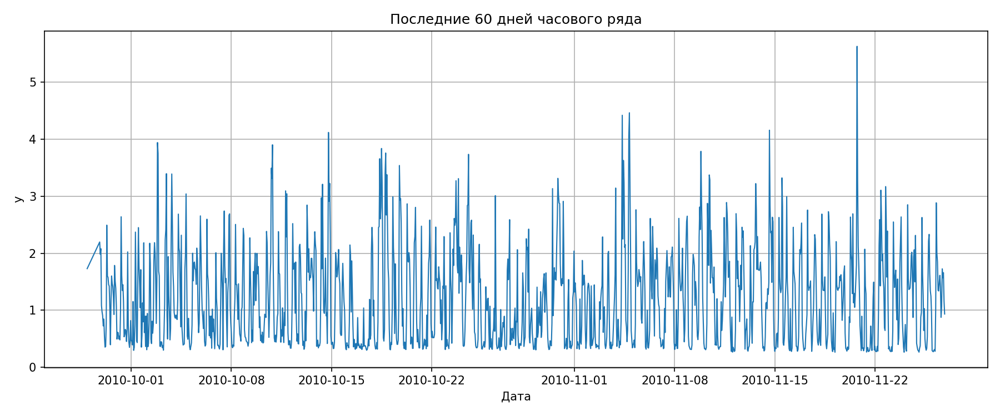

Профиль по часу суток:

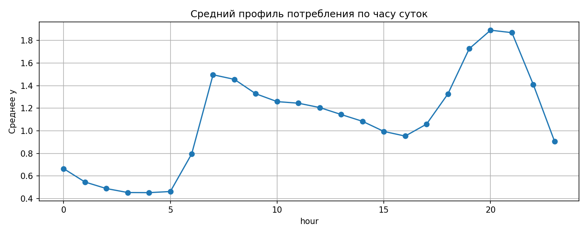

Профиль по дню недели:

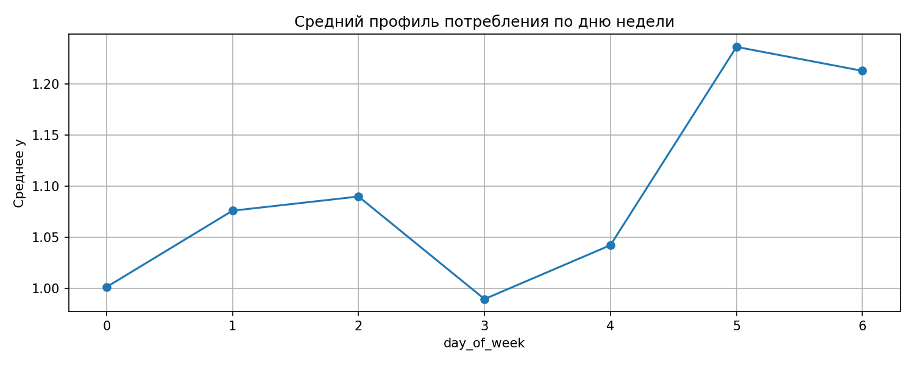

ACF и PACF:

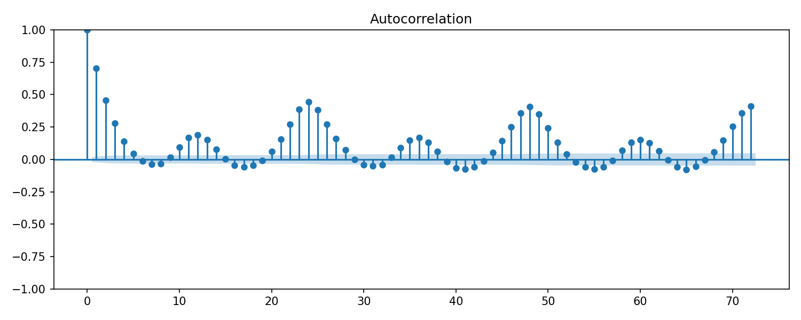

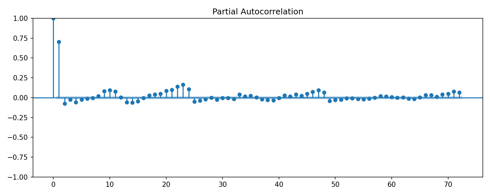

Проверка стационарности:

| Тест | Статистика | p-value | Вывод |
|---|---:|---:|---|
| ADF | -10.5035 | 1.07e-18 | аргумент в пользу стационарности |
| KPSS | 6.9562 | 0.0100 | стационарность отвергается |

Результаты тестов не полностью согласуются, поэтому ряд нельзя считать простым стационарным рядом. В нем присутствуют сезонность, изменения уровня и выбросы.

### Вывод по заданию №1

Ряд подготовлен корректно: временная сетка регулярная, пропусков в целевой переменной нет, частота — 1 час. EDA показал выраженные суточные и недельные закономерности, поэтому в дальнейшем используются сезонные периоды `24` и `168`.

---

## 4. Задание №2. Статистические методы прогнозирования

### 4.1. Методика сравнения

Статистические модели проверялись через backtesting по временным окнам. В каждом окне модель обучалась на прошлом и прогнозировала следующие 24 часа. Такой подход корректен для временных рядов, потому что не допускает случайного перемешивания прошлого и будущего.

Сравнивались baseline-модели, ручные статистические модели и автоматические модели из `statsforecast`.

### 4.2. Результаты статистических моделей

| Место | Модель | MAE | RMSE | MAPE | sMAPE | MASE |
|---:|---|---:|---:|---:|---:|---:|
| 1 | seasonal_window_average | 0.3306 | 0.4246 | 41.3157 | 32.4678 | 0.5172 |
| 2 | seasonal_naive_168 | 0.3494 | 0.4966 | 42.4453 | 35.4190 | 0.5467 |
| 3 | auto_ets | 0.3969 | 0.4917 | 55.3339 | 40.8020 | 0.6210 |
| 4 | auto_theta | 0.4029 | 0.4949 | 52.2807 | 41.1704 | 0.6303 |
| 5 | manual_theta_24 | 0.4031 | 0.4949 | 52.2844 | 41.1904 | 0.6307 |
| 6 | seasonal_naive_24 | 0.4411 | 0.5822 | 57.6934 | 44.4558 | 0.6902 |
| 7 | manual_ets_additive | 0.4192 | 0.5186 | 47.9249 | 44.6641 | 0.6559 |
| 8 | auto_arima | 0.4234 | 0.5092 | 73.2767 | 45.2895 | 0.6624 |
| 9 | window_average_168 | 0.6003 | 0.7019 | 102.0992 | 58.7645 | 0.9392 |
| 10 | manual_arima | 0.6169 | 0.7204 | 109.0453 | 59.5385 | 0.9652 |
| 11 | naive | 0.6524 | 0.7793 | 133.7039 | 59.8480 | 1.0207 |
| 12 | drift | 0.6531 | 0.7804 | 134.0492 | 59.8669 | 1.0219 |

Сравнение метрик:

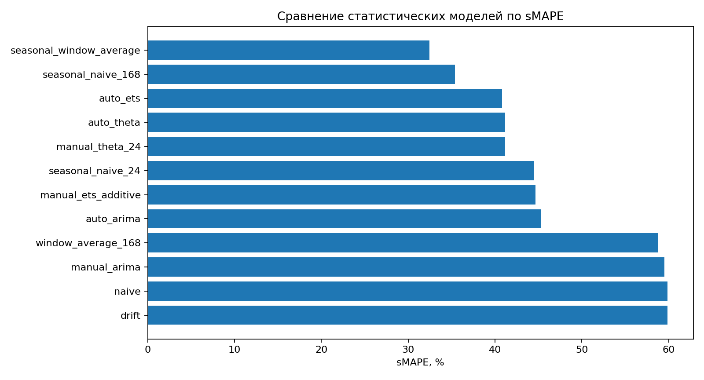

Backtesting:

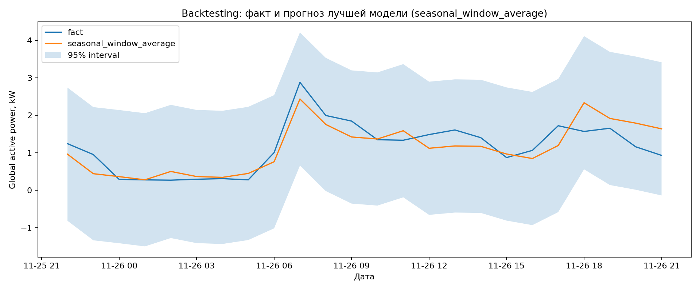

Финальный прогноз:

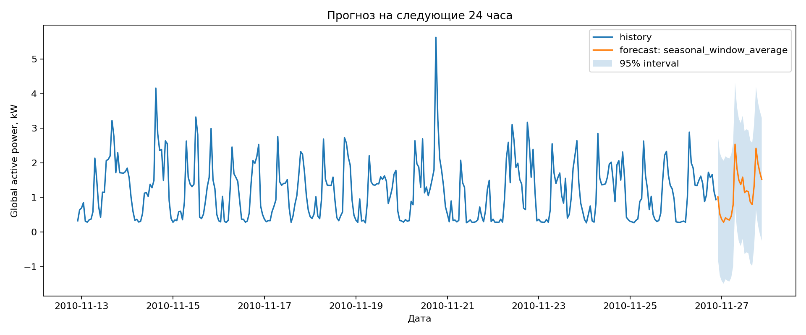

### 4.3. Анализ остатков

| Показатель | Значение |
|---|---:|
| Среднее остатков | -0.0260 |
| Стандартное отклонение остатков | 0.4258 |
| MAE остатков | 0.3306 |
| Автокорреляция остатков на лаге 1 | 0.4567 |
| p-value Ljung-Box, лаг 24 | 4.06e-08 |

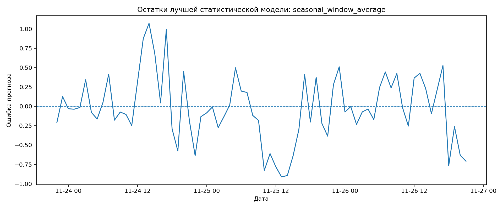

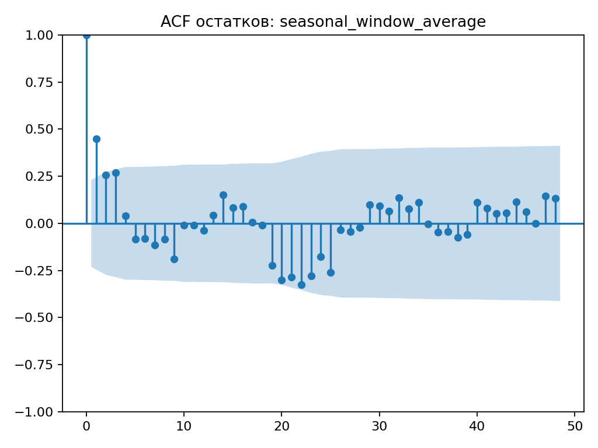

### Вывод по заданию №2

Лучшей статистической моделью стала `seasonal_window_average`, `sMAPE = 32.4678`. Она превзошла naive и seasonal naive baseline. Ее преимущество объясняется тем, что она учитывает недельную повторяемость и сглаживает случайные всплески, что хорошо соответствует природе бытового электропотребления.

---

## 5. Задание №3. Аномалии, ML и DL

## 5.1. Анализ аномалий

### Проверенные методы

| Метод | Параметры | Логика |
|---|---|---|
| Rolling z-score | окно 168 часов, порог 3.5 | сравнение с локальным уровнем ряда |
| Seasonal IQR | профиль по часу недели, IQR = 3.0 | поиск отклонений от сезонного профиля |
| Isolation Forest | contamination = 0.01 | многомерный поиск нетипичных наблюдений |

### Результаты

| Метод | Количество аномалий | Доля, % |
|---|---:|---:|
| rolling_z_score | 309 | 0.893 |
| seasonal_iqr | 363 | 1.049 |
| isolation_forest | 345 | 0.997 |

Выбран метод **Seasonal IQR**, так как он учитывает недельную структуру ряда и анализирует отклонения от типичного сезонного профиля.

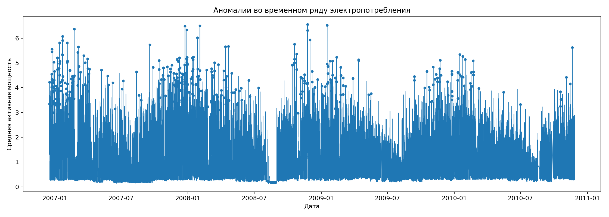

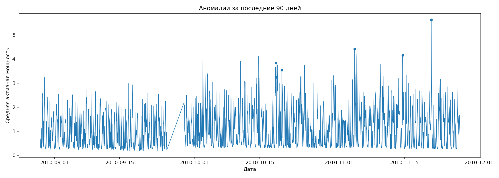

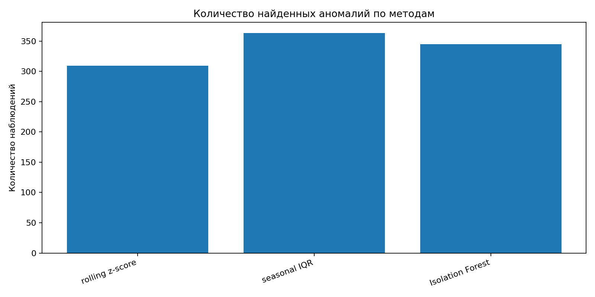

### Вывод по аномалиям

Seasonal IQR выявил 363 аномальных наблюдения, что составляет 1.049% ряда. Аномалии не удалялись автоматически, так как они могут соответствовать реальным пикам потребления. Они рассматриваются как диагностическая информация для дальнейшего анализа.

## 5.2. ML-модели

Для ML-моделей были сформированы лаговые, скользящие и календарные признаки. Ряд был преобразован в табличную задачу регрессии.

### Результаты ML-моделей

| Место | Модель | MAE | RMSE | MAPE | sMAPE | MASE |
|---:|---|---:|---:|---:|---:|---:|
| 1 | random_forest | 0.3421 | 0.4300 | 48.3824 | 35.8655 | 0.5352 |
| 2 | hist_gradient_boosting | 0.3769 | 0.4769 | 51.3950 | 37.2044 | 0.5897 |
| 3 | ridge_regression | 0.4056 | 0.5286 | 53.8389 | 39.0194 | 0.6345 |

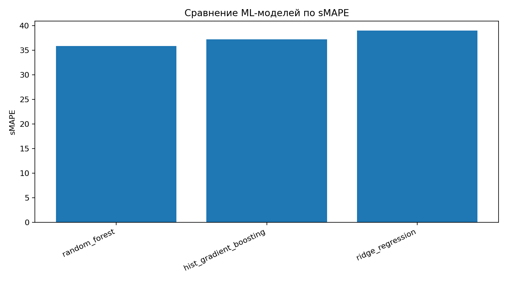

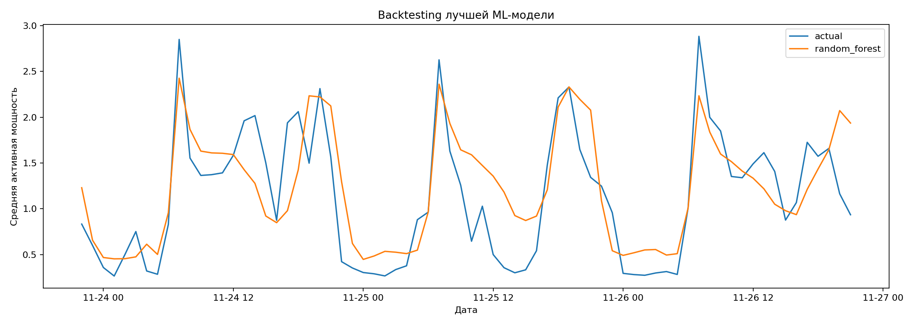

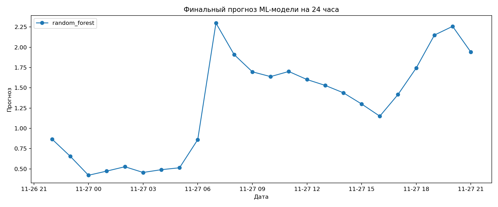

### Вывод по ML

Лучшей ML-моделью стала `random_forest`, `sMAPE = 35.8655`. Модель хорошо использует нелинейные зависимости и лаговые признаки, но не превзошла лучшую статистическую модель.

## 5.3. DL-модели

Проверены 3 DL-модели: `neural_mlp`, `nbeats`, `nhits`. Горизонт прогноза — 24 часа, историческое окно — 168 часов.

### Результаты DL-моделей

| Место | Модель | MAE | RMSE | MAPE | sMAPE | MASE |
|---:|---|---:|---:|---:|---:|---:|
| 1 | nbeats | 0.3503 | 0.4421 | 42.6360 | 35.7025 | 0.6141 |
| 2 | neural_mlp | 0.3518 | 0.4536 | 39.1979 | 37.9348 | 0.6166 |
| 3 | nhits | 0.3810 | 0.4736 | 55.2723 | 39.6782 | 0.6678 |

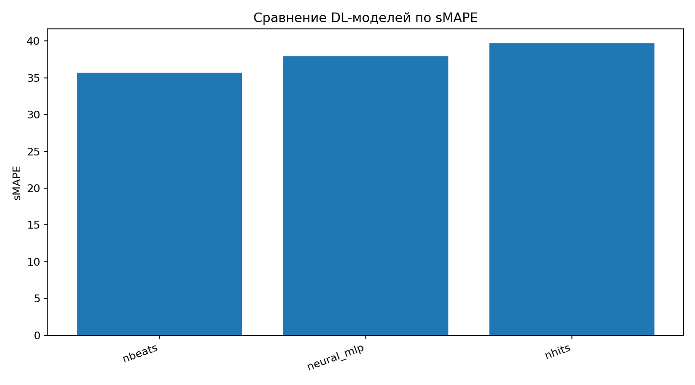

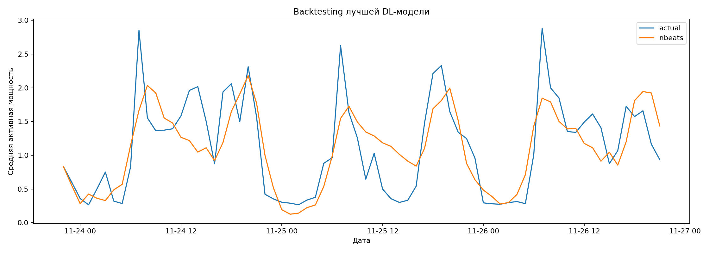

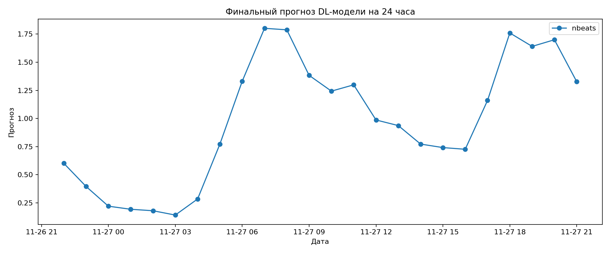

### Вывод по DL

Лучшей DL-моделью стала `nbeats`, `sMAPE = 35.7025`. Она оказалась близка к лучшей ML-модели, но не превзошла `seasonal_window_average`. Это показывает, что в данном ряде простая сезонная структура является очень сильным фактором прогноза.

---

## 6. Общая таблица выбора моделей

| Место | Группа | Модель | MAE | RMSE | MAPE | sMAPE | MASE |
|---:|---|---|---:|---:|---:|---:|---:|
| 1 | statistical | seasonal_window_average | 0.3306 | 0.4246 | 41.3157 | 32.4678 | 0.5172 |
| 2 | statistical | seasonal_naive_168 | 0.3494 | 0.4966 | 42.4453 | 35.4190 | 0.5467 |
| 3 | DL | nbeats | 0.3503 | 0.4421 | 42.6360 | 35.7025 | 0.6141 |
| 4 | ML | random_forest | 0.3421 | 0.4300 | 48.3824 | 35.8655 | 0.5352 |
| 5 | ML | hist_gradient_boosting | 0.3769 | 0.4769 | 51.3950 | 37.2044 | 0.5897 |
| 6 | DL | neural_mlp | 0.3518 | 0.4536 | 39.1979 | 37.9348 | 0.6166 |
| 7 | ML | ridge_regression | 0.4056 | 0.5286 | 53.8389 | 39.0194 | 0.6345 |
| 8 | DL | nhits | 0.3810 | 0.4736 | 55.2723 | 39.6782 | 0.6678 |
| 9 | statistical | auto_ets | 0.3969 | 0.4917 | 55.3339 | 40.8020 | 0.6210 |
| 10 | statistical | auto_theta | 0.4029 | 0.4949 | 52.2807 | 41.1704 | 0.6303 |
| 11 | statistical | manual_theta_24 | 0.4031 | 0.4949 | 52.2844 | 41.1904 | 0.6307 |
| 12 | statistical | seasonal_naive_24 | 0.4411 | 0.5822 | 57.6934 | 44.4558 | 0.6902 |
| 13 | statistical | manual_ets_additive | 0.4192 | 0.5186 | 47.9249 | 44.6641 | 0.6559 |
| 14 | statistical | auto_arima | 0.4234 | 0.5092 | 73.2767 | 45.2895 | 0.6624 |
| 15 | statistical | window_average_168 | 0.6003 | 0.7019 | 102.0992 | 58.7645 | 0.9392 |
| 16 | statistical | manual_arima | 0.6169 | 0.7204 | 109.0453 | 59.5385 | 0.9652 |
| 17 | baseline | naive | 0.6524 | 0.7793 | 133.7039 | 59.8480 | 1.0207 |
| 18 | statistical | drift | 0.6531 | 0.7804 | 134.0492 | 59.8669 | 1.0219 |

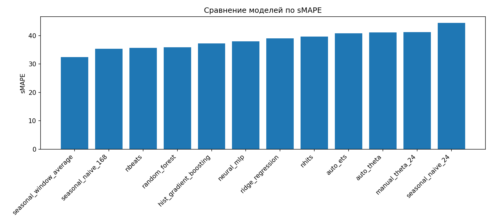

### Итог по выбору модели

Для итогового пайплайна выбрана модель `seasonal_window_average`. Она показала лучшее значение sMAPE на backtesting-окнах и имеет понятную интерпретацию. По сравнению с простым naive baseline ошибка sMAPE снизилась с 59.8480 до 32.4678.

---

## 7. Задание №4. Пайплайн решения задачи

### 7.1. Состав пайплайна

Пайплайн выполняет:

1. загрузку подготовленного ряда;
2. проверку структуры данных;
3. проверку пропусков, дубликатов и регулярности частоты;
4. загрузку результатов моделей;
5. выбор лучшей модели по sMAPE;
6. построение прогноза на 24 часа;
7. backtesting;
8. статистическое тестирование остатков;
9. тестирование производительности;
10. сохранение прогнозов, таблиц и графиков.

### 7.2. Метрики итогового пайплайна

| Модель | MAE | RMSE | MAPE | sMAPE | MASE |
|---|---:|---:|---:|---:|---:|
| seasonal_naive_168 | 0.4102 | 0.5725 | 42.1455 | 37.6462 | 0.6421 |
| seasonal_window_average | 0.4100 | 0.5096 | 55.9527 | 41.1866 | 0.6417 |

### 7.3. Проверки входных данных

| Проверка | Статус | Детали |
|---|---|---|
| required_columns | pass | обязательные колонки `unique_id`, `ds`, `y` есть |
| no_duplicate_timestamps | pass | дубликатов временных меток нет |
| no_missing_target | pass | пропусков в `y` нет |
| regular_hourly_frequency | pass | временная сетка регулярная |
| enough_history | pass | 34 589 наблюдений достаточно для недельной сезонности и прогноза 24 часа |
| non_negative_target | pass | отрицательных значений нет |

### 7.4. Статистические тесты

| Тест | Статистика | p-value | Статус | Интерпретация |
|---|---:|---:|---|---|
| bias_ttest | -0.0953 | 0.9242 | pass | среднее смещение остатков статистически незначимо |
| ljung_box_lag_24 | 67.3272 | 5.51e-06 | warn | в остатках осталась автокорреляционная структура |
| paired_ttest_vs_seasonal_naive_168 | -0.0069 | 0.9945 | pass | отличие абсолютных ошибок от seasonal naive статистически незначимо |

### 7.5. Производительность

| Этап | Время, сек. |
|---|---:|
| load_data | 0.0756 |
| validate_data | 0.0043 |
| model_selection | 0.0243 |
| backtesting | 0.4800 |
| forecast | 0.0768 |
| statistical_tests | 0.0563 |
| plots | 2.1362 |
| total | 2.8538 |
| peak_memory_mb | 6.2955 |

### 7.6. Визуализации пайплайна

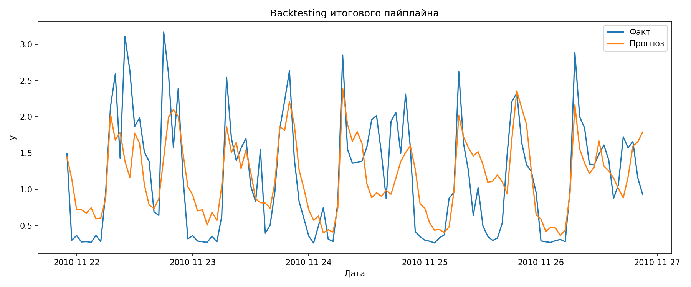

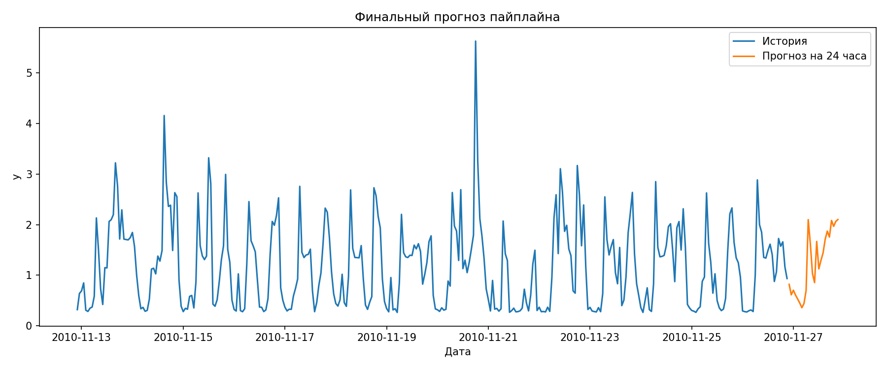

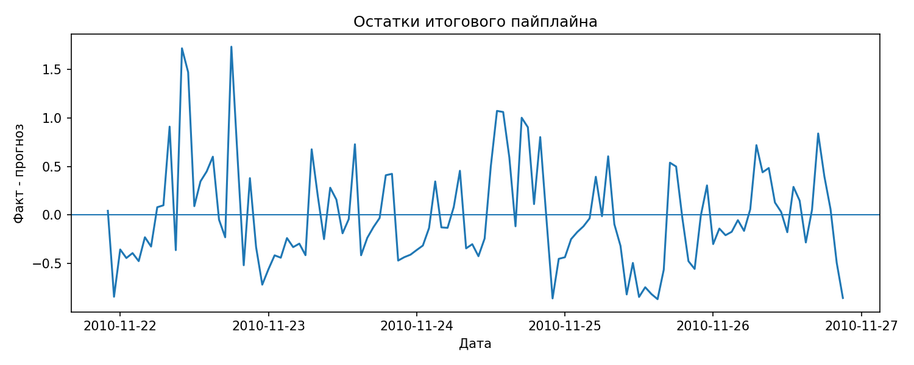

### Вывод по заданию №4

Пайплайн является воспроизводимым: он выполняет проверки данных, выбирает модель, строит прогноз, сохраняет таблицы и графики, а также проводит статистическое тестирование и оценку производительности. Наличие предупреждения по Ljung-Box показывает, что в остатках есть структура, поэтому пайплайн можно улучшать, но текущая версия корректно выполняет все основные этапы задания.

---

## 8. Общий вывод по работе

В ходе работы был реализован полный цикл анализа временного ряда электропотребления. Данные были подготовлены и приведены к регулярной часовой частоте, затем выполнены EDA, анализ сезонности, проверка стационарности и анализ аномалий. Далее были сравнены статистические, ML- и DL-модели прогнозирования.

Ключевой результат состоит в том, что лучшей моделью стала не самая сложная нейросетевая модель, а статистическая модель `seasonal_window_average`. Это объясняется природой данных: бытовое электропотребление имеет устойчивую суточную и недельную повторяемость. Поэтому модель, прямо использующая аналогичные часы недели, оказалась наиболее точной и интерпретируемой.

В то же время анализ остатков показал, что в ошибках сохраняется автокорреляция. Это означает, что ряд содержит дополнительные зависимости, которые можно исследовать в дальнейшем. Возможные направления улучшения: добавление внешних факторов, более тонкий feature engineering, настройка ML/DL-моделей и проверка устойчивости на большем числе последних временных окон.

---

## 9. Основные артефакты проекта

| Артефакт | Путь |
|---|---|
| Подготовленный ряд | `data/processed/prepared_time_series.csv` |
| Jupyter Notebook | `notebooks/main_pipeline.ipynb` |
| Итоговая таблица моделей | `reports/tables/model_comparison.csv` |
| Прогноз пайплайна | `outputs/forecasts/pipeline_forecast.csv` |
| Таблицы результатов | `reports/tables/` |
| Визуализации | `reports/figures/` |
| Код пайплайна | `scripts/run_pipeline.py`, `src/` |
| Чек-лист задания | `TASK_CHECKLIST.md` |

